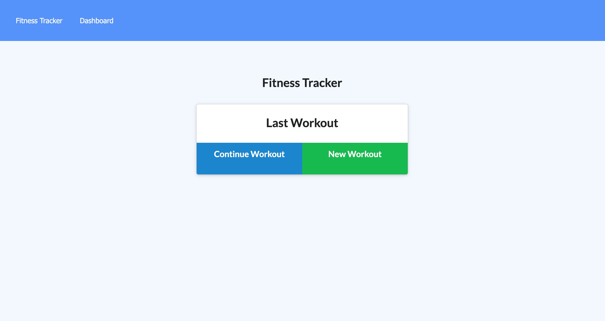

# Workout Tracker

## Project Description

This application is a workout tracker. This application uses a Mongo database with a Mongoose schema and handle routes with Express.

## User Story

* As a user, I want to be able to view create and track daily workouts. I want to be able to log multiple exercises in a workout on a given day. I should also be able to track the name, type, weight, sets, reps, and duration of exercise. If the exercise is a cardio exercise, I should be able to track my distance traveled.

## Screenshot

The following image shows the application's appearance and functionality:

The URL of the Heroku application is: 
<https://akn-fitness-tracker.herokuapp.com/>

The URL of the GitHub repository is: 
<https://github.com/ArshleenKNagpal/Workout-Tracker>

---
© 2021 Trilogy Education Services, LLC, a 2U, Inc. brand. Confidential and Proprietary. All Rights Reserved.

